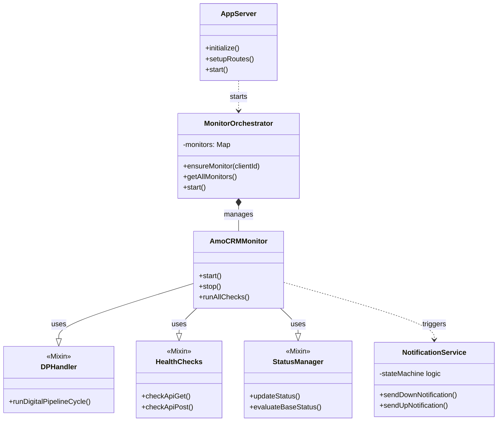
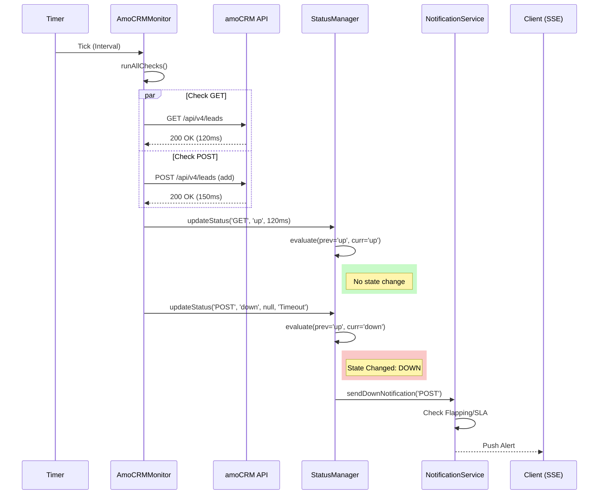

# Architecture Documentation: amoCRM Health Monitor v2.0

## Обзор
Проект представляет собой Self-contained Full-stack приложение для мониторинга доступности amoCRM и критических интеграций. Архитектура построена на принципах модульности и мульти-тенантности, позволяя обслуживать несколько клиентов (аккаунтов amoCRM) в рамках одного инстанса.

### Ключевые компоненты
1.  **Backend (Node.js/Express)**: 
    - REST API для фронтенда.
    - Фоновые процессы мониторинга (Health Checks).
    - Оркестратор для управления клиентами.
    - SSE (Server-Sent Events) для уведомлений в реальном времени.
2.  **Frontend (React/Vite)**: 
    - SPA дашборд.
    - Визуализация статусов и графиков.
3.  **Infrastructure**: 
    - Docker + Compose.
    - Nginx (Reverse Proxy).
    - SQLite (Persistance).

---

## Backend Architecture

### Структура классов
Backend построен вокруг `AppServer` (конфигурация Express) и `MonitorOrchestrator` (управление бизнес-логикой мониторинга).

#### Class Diagram

### Поток данных (Data Flow)
1.  **Инициализация**: `index.js` запускает `MonitorOrchestrator`.
2.  **Orchestrator**: Загружает конфиги клиентов из `ClientRegistry` и создает инстансы `AmoCRMMonitor`.
3.  **Monitor**:
    -   Запускает периодические проверки (Mixin `HealthChecks`).
    -   Обновляет статус через `StatusManager`.
    -   Если статус изменился -> Вызывает `NotificationService` и обновляет `metrics` (Prometheus).
    -   Уведомляет Orchestrator, который пушит событие в SSE.

#### Sequence Diagram: Health Check Cycle

---

## Frontend Architecture

Frontend использует компонентную архитектуру React.

### Component Hierarchy
-   `App` (Routing, Global Layout)
    -   `HealthMonitorDashboard` (Smart container)
        -   `HealthMonitorDashboardWithData` (Pure presentational)
            -   `ServiceCard` (Status visualization)
            -   `ResponseTimeChart` (Chart.js wrapper)
            -   `IncidentHistory` (List view)
        -   `useMonitoring` (Custom Hook: SSE + Polling logic)

---

## Multi-Tenancy

Система поддерживает изоляцию клиентов через `clientId`.
-   **Config**: `ClientRegistry` загружает конфигурации из ENV.
-   **Execution**: Каждый клиент имеет свой независимый инстанс `AmoCRMMonitor`.
-   **Storage**: Данные в SQLite разделены колонкой `client_id` (Soft Isolation).
-   **API**: Все эндпоинты принимают `?clientId=...`.

## Observability

1.  **Logs**: Winston logger с ротацией. Файлы в `logs/`.
2.  **Metrics**: Prometheus endpoint `/api/metrics`.
3.  **Alerting**: Mattermost webhook + Email.
